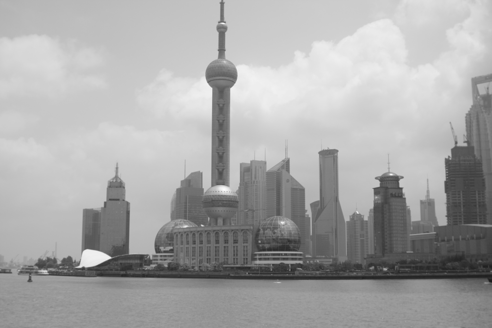
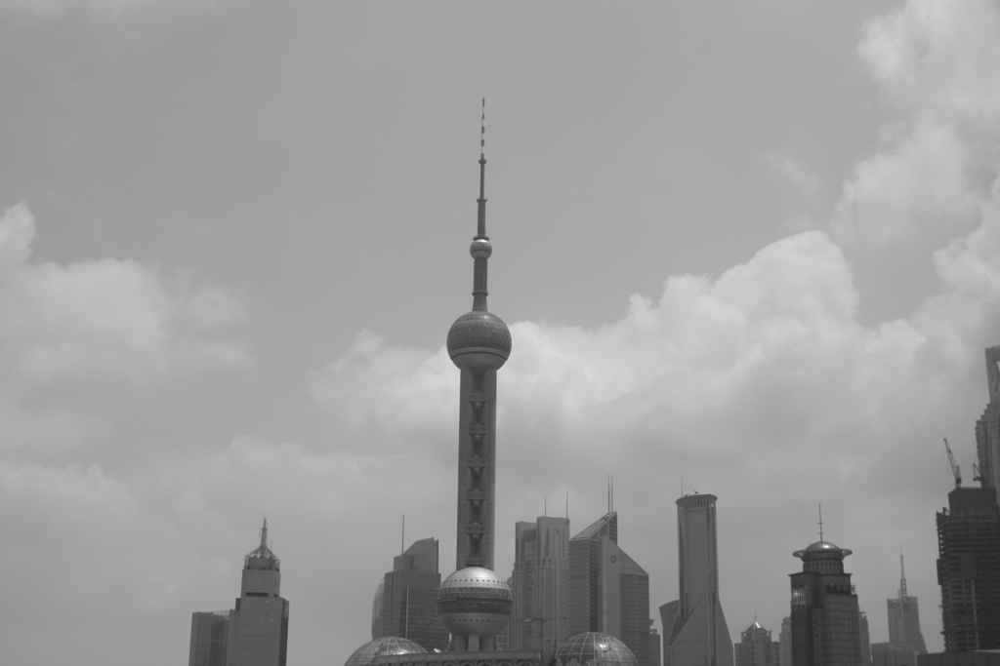
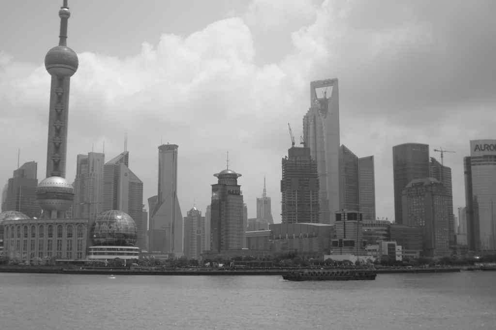
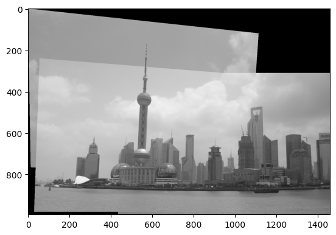

# 🧵 Image Mosaics using Planar Homographies

This project demonstrates the construction of seamless **image mosaics** by warping one image into the plane of another using **homography transformations**. The final output is a panoramic image composed of two (or more) aligned views.

---

## 🎯 Objective

The primary goal is to:
- Detect matching feature points between two overlapping images.
- Estimate the **homography matrix**.
- Warp one image to the plane of the other.
- Create a **stitched mosaic** that combines both images.

---

## 📚 Theoretical Background

### 📐 Homography

A **homography** is a transformation that maps points from one plane to another using a 3x3 matrix. It’s suitable for stitching images captured from slightly different viewpoints (especially in the case of planar scenes).

---

## 🛠️ Implementation Pipeline

### 1️⃣ Feature Matching and Homography Estimation

- Detect corresponding feature points manually or automatically between the two input images.
- Estimate the **homography matrix** using the correspondences.

### 2️⃣ Image Warping

- Apply the homography to warp the source image into the reference frame of the second image.
- Each RGB channel is warped separately and stacked to form the full-color image.
- An **inverse warping** strategy is used to avoid holes and preserve image quality.
- **Linear interpolation** is used to estimate pixel values for sub-pixel coordinates.

### 3️⃣ Mosaic Creation

- A canvas is created large enough to accommodate both warped images.
- Overlay the warped source image onto the destination image.
- No blending is used; areas without data remain black.

---

## 🏆 Stitching Three Images

An additional challenge includes stitching **three overlapping images** to form a larger panorama:

1. Stitch image A and B using the described method.
2. Find feature correspondences between the resulting mosaic and image C.
3. Warp and stitch image C with the AB mosaic to produce the final panoramic output.

> ⚠️ Note: The **order of stitching** significantly affects the final result!

---

## 📁 Project Structure
📁 image-mosaics/
┣ 📄 README.md ← This file

┣ 📓 mosaics.ipynb ← Main implementation notebook

┣ 📁 materials/ ← Input images (e.g., view1.jpg, view2.jpg)

## 🖼️ Example Images

### Original Images
|  |  |
|:-----------------------------------------:|:-----------------------------------------:|
| pano_image1.jpg                           | pano_image2.jpg                           |

|  |  |  |
|:-------------------------------------------:|:-------------------------------------------:|:-------------------------------------------:|
| shanghai-21.png                            | shanghai-22.png                            | shanghai-23.png                            |

### Final Result
|  |
|:--------------------------------------------------:|
| 3 stitches result.png                               |

---
